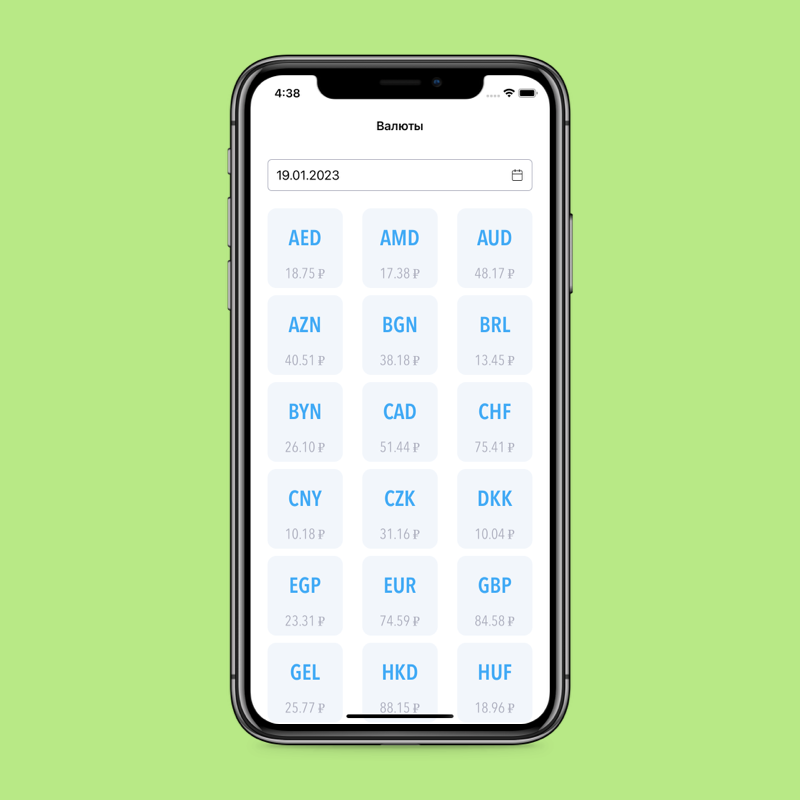
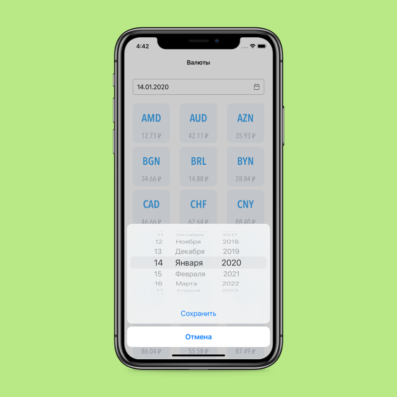
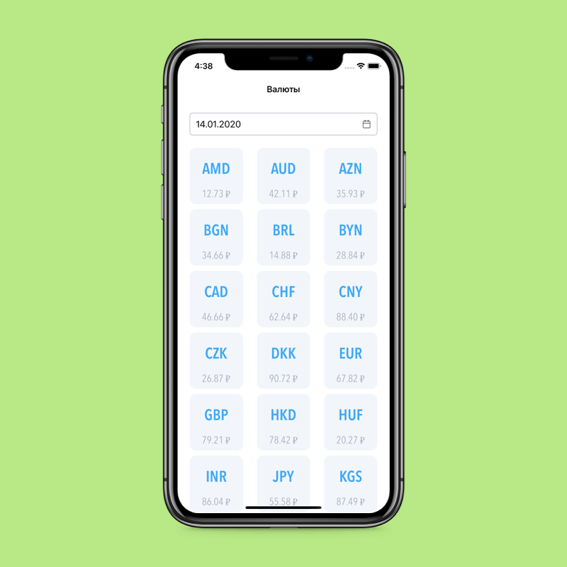
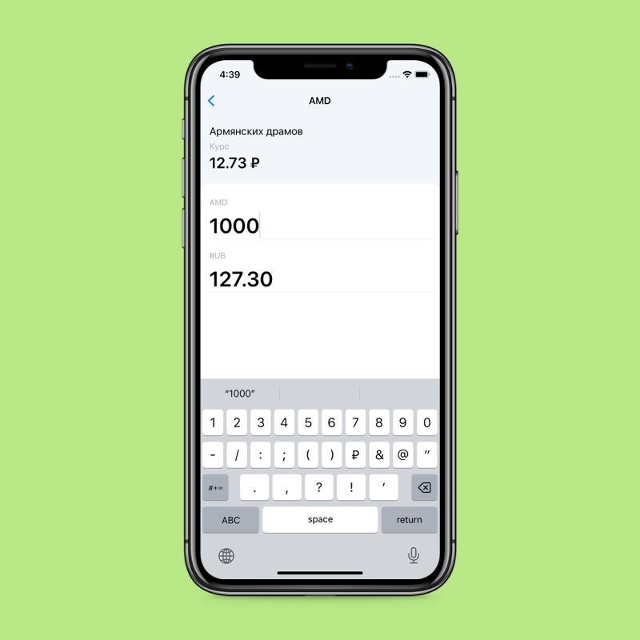

# Currency converter
💰 This application can help you to check currency rates for different dates and convert to rub.

## Stack
* MVP
* UIKit
* Alamofire
* SnapKit
* Realm 
* SwiftLint

## Screenshots

